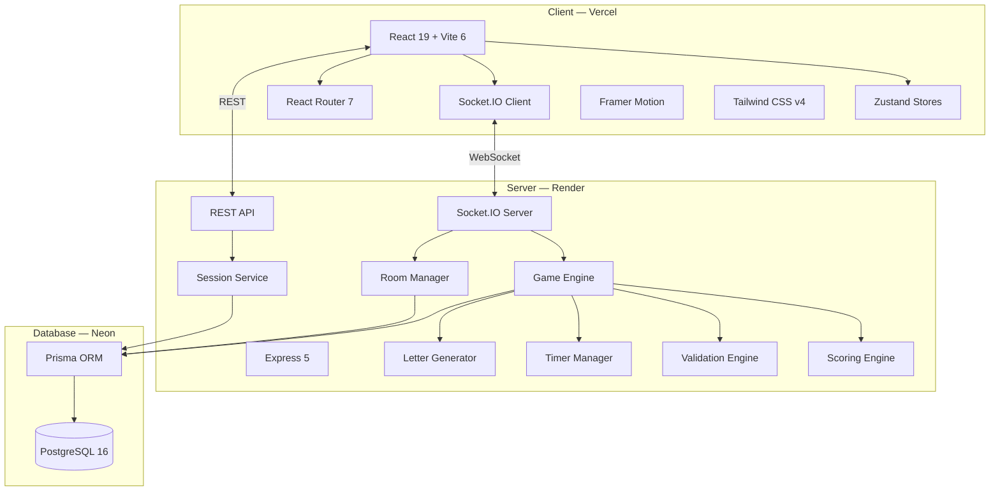
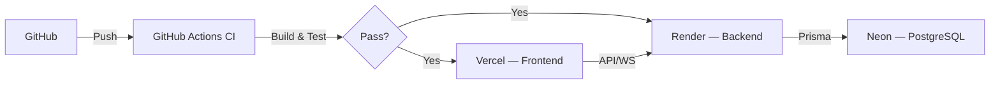

# NPTA — System Architecture

## High-Level Architecture



## Backend Architecture (Clean Architecture)

```
Request Flow:
  Client → Socket.IO/REST → Handler/Controller → Service → Engine → Database
  
Response Flow:
  Database → Engine → Service → Socket.IO Broadcast/REST Response → Client
```

### Layers

| Layer | Responsibility | Example Files |
|-------|---------------|---------------|
| **Transport** | HTTP/WebSocket protocol | `socket/handlers/`, `routes/`, `controllers/` |
| **Service** | Business logic coordination | `services/SessionService.ts` |
| **Engine** | Core game logic | `engine/GameEngine.ts`, `ScoringEngine.ts` |
| **Data** | Database operations | `lib/prisma.ts`, Prisma queries in services |

## Frontend Architecture

```
Component Hierarchy:
  App
  ├── HomePage
  │   ├── ThemeToggle
  │   ├── Input (name)
  │   ├── Button (create/join)
  │   └── Card (recent rooms)
  ├── LobbyPage
  │   ├── RoomCode
  │   ├── QRCode
  │   ├── PlayerCard[]
  │   ├── SettingsPanel (host)
  │   └── Button (start/ready)
  ├── GamePage
  │   ├── Timer
  │   ├── LetterReveal
  │   ├── CategoryInput[5]
  │   └── Button (submit)
  └── WinnerPage
      ├── Podium
      ├── Confetti
      ├── Leaderboard
      └── Buttons (play again/home)
```

### State Management (Zustand)

| Store | Scope | Persistence |
|-------|-------|-------------|
| `playerStore` | Player identity, session | localStorage |
| `roomStore` | Room state, players | Memory |
| `gameStore` | Game/round state, answers | Memory |
| `socketStore` | Socket connection | Memory |
| `settingsStore` | Theme, sound prefs | localStorage |

## Security Architecture

| Layer | Measure |
|-------|---------|
| Transport | Helmet headers, CORS |
| Auth | UUID session tokens, socket auth middleware |
| Input | Zod validation, input sanitization |
| Game Logic | 100% server-authoritative, never trust client |
| Rate Limiting | Express rate limiter on REST endpoints |
| Room Codes | Unambiguous charset (no I/O/0/1) |

## Deployment Architecture


