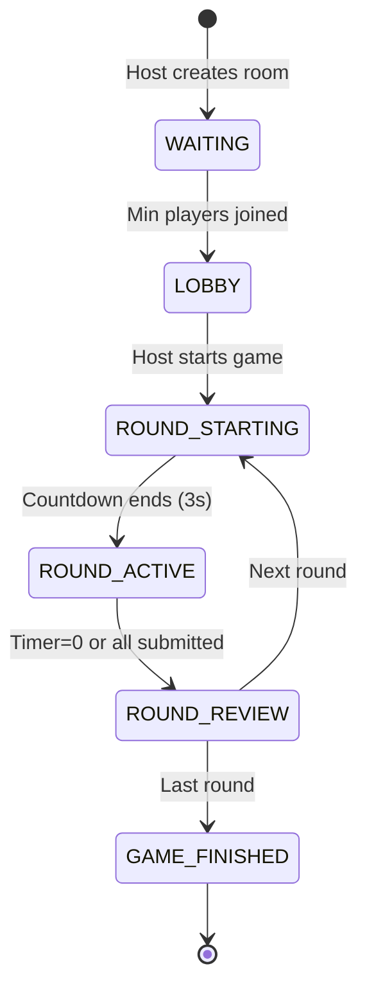

# NPTA — WebSocket Event Specification

## Connection

Connect with session token in auth:

```typescript
const socket = io('http://localhost:3001', {
  auth: { token: 'session-token-uuid' },
  transports: ['websocket', 'polling'],
});
```

---

## Client → Server Events

### Room Events

| Event | Payload | Callback | Description |
|-------|---------|----------|-------------|
| `room:create` | `{ settings?: Partial<RoomSettings> }` | `SocketResponse<RoomInfo>` | Create a new room |
| `room:join` | `{ roomCode: string }` | `SocketResponse<RoomInfo>` | Join an existing room |
| `room:leave` | `{}` | — | Leave current room |
| `room:settings` | `{ settings: Partial<RoomSettings> }` | — | Update room settings (host only) |

### Player Events

| Event | Payload | Description |
|-------|---------|-------------|
| `player:ready` | `{ isReady: boolean }` | Toggle ready status |

### Game Events

| Event | Payload | Callback | Description |
|-------|---------|----------|-------------|
| `game:start` | `{}` | — | Start the game (host only) |
| `game:submit` | `{ answers: RoundAnswers }` | `SocketResponse<null>` | Submit round answers |

### Chat Events

| Event | Payload | Description |
|-------|---------|-------------|
| `chat:message` | `{ message: string }` | Send chat message |
| `chat:emoji` | `{ emoji: string }` | Send emoji reaction |

---

## Server → Client Events

### Room Events

| Event | Payload | Description |
|-------|---------|-------------|
| `room:created` | `RoomInfo` | Room created confirmation |
| `room:joined` | `RoomInfo` | Join confirmation with full state |
| `room:player_joined` | `PlayerInfo` | New player joined |
| `room:player_left` | `{ playerId: string }` | Player left |
| `room:player_reconnected` | `{ playerId: string }` | Player came back online |
| `room:host_changed` | `{ newHostId, newHostName }` | Host transferred |
| `room:settings_updated` | `RoomSettings` | Settings changed |
| `room:player_ready` | `{ playerId, isReady }` | Ready status changed |

### Game Events

| Event | Payload | Description |
|-------|---------|-------------|
| `game:started` | `GameInfo` | Game has started |
| `game:round_starting` | `{ round: RoundInfo, countdown: number }` | Round countdown (letter revealed) |
| `game:round_active` | `{ round: RoundInfo }` | Round timer started |
| `game:timer_update` | `{ remaining: number }` | Timer tick (every second) |
| `game:player_submitted` | `{ playerId: string }` | A player submitted answers |
| `game:round_completed` | `RoundResult` | Round results with scores |
| `game:leaderboard` | `{ leaderboard: LeaderboardEntry[] }` | Updated leaderboard |
| `game:finished` | `{ winner, leaderboard }` | Game over |

### System Events

| Event | Payload | Description |
|-------|---------|-------------|
| `session:restored` | `{ room: RoomInfo, game: GameInfo \| null }` | State restored on reconnect |
| `error` | `{ code: string, message: string }` | Error notification |

---

## Game State Flow


